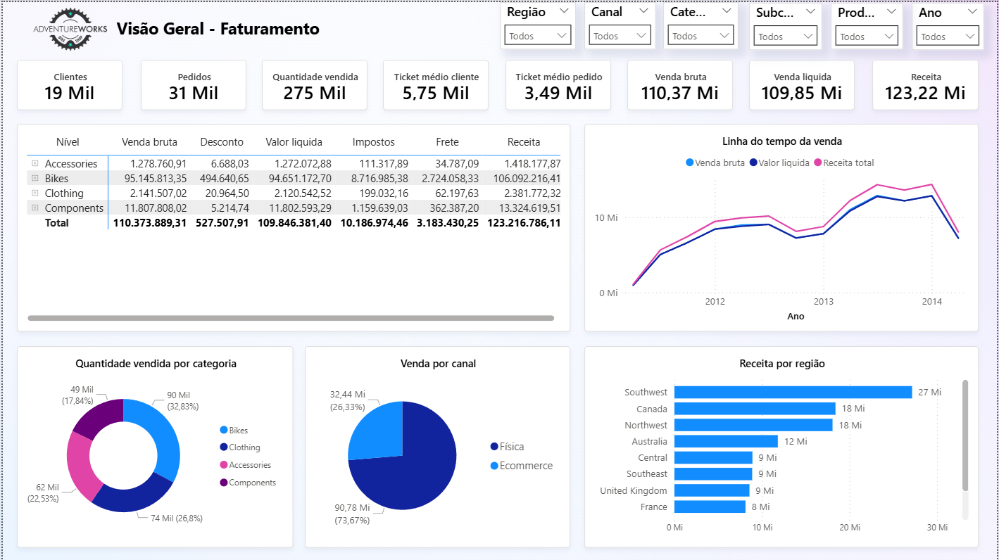
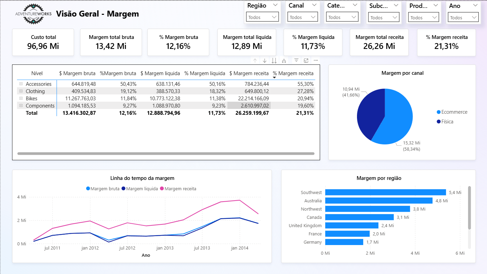
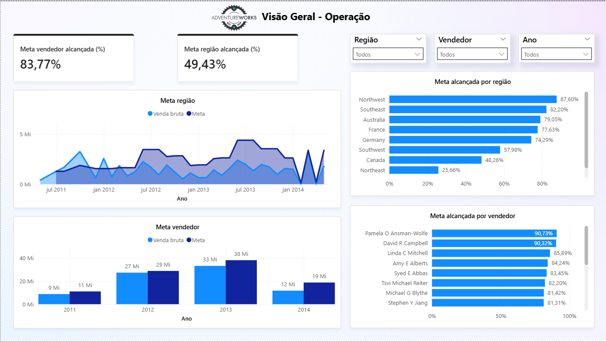

# 🚴‍♂️ Análise AdventureWorks2022

Este projeto apresenta uma abordagem analítica para avaliação da performance comercial da empresa AdventureWorks. O objetivo é apresentar um projeto real voltado à tomada de decisões rápidas e orientadas por dados.

---

## 🎯 Objetivo

Entregar aos tomadores de decisão uma visão clara e estratégica sobre:

- Receita e lucratividade por região, canal e categoria de produto  
- Evolução mensal das vendas e identificação de sazonalidade  
- Produtos com maior impacto financeiro (volume vs. margem)  
- Comparativo entre canais de venda (online vs. físico)  
- Performance regional em relação às metas estabelecidas

🔗 [Veja meu Dashboard no Power BI](https://app.powerbi.com/view?r=eyJrIjoiMjMwZDVlZGQtMDg2Ni00M2M3LTgxZDEtOWQ5YjJhZjExZjE4IiwidCI6ImVjNTRhZmM0LTI1YjctNGUwMS1hNDM2LWIyZmZlNmQyZDhjMCJ9)

---

## 🛠️ Tecnologias e Ferramentas

- **Power BI**: Utilizado para ETL, modelagem com DAX e visualização de dados  
- **SQL Server**: Fonte de dados original para todos os dashboards

---

## 🗂️ Visões do Projeto

### 1. **Visão Geral – Faturamento**
- KPIs principais: valor de venda, receita total, ticket médio, quantidade vendida, número de pedidos e clientes  
- Linha do tempo do faturamento total  
- Gráfico de barras do faturamento por região  
- Gráfico de rosca para quantidade vendida por categoria  
- Tooltip no gráfico de rosca para detalhamento por produto  
- Gráfico de pizza para faturamento por canal

### 2. **Visão Geral – Margem**
- KPIs principais: custo e margem  
- Matriz para análise de margem por categoria, subcategoria e produto  
- Gráfico de pizza para margem por canal  
- Linha do tempo para evolução da margem  
- Gráfico de barras para margem por região

### 3. **Visão Geral – Operação**
- KPI principal: meta alcançada  
- Linha do tempo comparando venda bruta e meta por região  
- Gráfico de colunas comparando venda bruta e meta por vendedor  
- Gráfico de barras para meta alcançada por vendedor e por região

---

## 📊 Principais Insights

- Receita total de **R$ 123,22 milhões**, com **275 mil produtos vendidos** e cerca de **19 mil clientes**, resultando em uma **margem final de 21,31%**  
- **Picos de vendas** identificados nos meses de **junho** e **outubro**  
- O faturamento das **lojas físicas representa 73,67%** do total  
- A região **Southwest** lidera em faturamento  
- A categoria com maior volume de vendas foi **Bikes**, e o produto mais vendido em quantidade foi o **AWC Logo Cap**  
- O **e-commerce gera maior lucratividade**, representando quase **60% do lucro total**  
- A categoria **Accessories** apresenta a **maior margem percentual**, enquanto **Bikes** lidera em **lucro absoluto**  
- Na maior parte do tempo, as **metas não foram atingidas**, com desempenho médio de **83,77% para vendedores** e **49,43% nas metas regionais**

---

## 📷 Dashboards

  
  

---

## 📁 Arquivos do Repositório

- `Data/` — Base de dados modelada via SQL  
- `Imagens/` — Capturas dos dashboards  
- `README.md` — Documentação do projeto

---

## 📌 Requisitos

Para visualizar o projeto completo, é necessário ter o **Power BI Desktop** instalado.

---

## 🔄 Futuras evoluções

Inserção da aba de **Compras**, para visualizar de forma mais detalhada os custos, entregas, pedidos e demais indicadores operacionais.

---

## 📬 Contato

Projeto desenvolvido por **Guilherme de Queiroz**  
🔗 [LinkedIn](https://www.linkedin.com/in/guilherme-de-queiroz-5033981b9/)  
📧 dequeirozguilherme1899@gmail.com  
🔗 [Portfólio no GitHub](https://github.com/dequeirozguilherme1989-tech)

